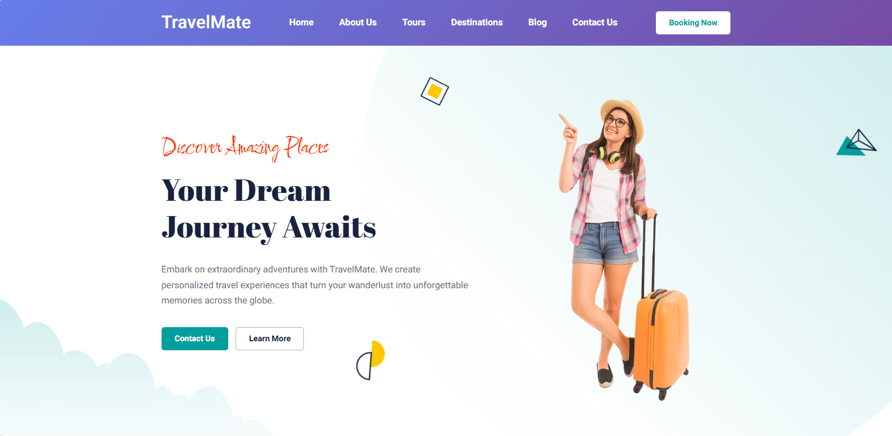

<div align="center">
  

  <h2 align="center">🌍 TravelMate - Tourist Website</h2>

TravelMate is a fully responsive **tourist website** <br />
Responsive for all devices, built using **React and Tailwind CSS**

  <a href="https://simran-kumari123.github.io/travelmate/"><strong>➥ Live Demo</strong></a>

</div>

<br />

### 🚀 Demo Screenshots



---

### ✅ Prerequisites

Before you begin, ensure you have installed the following:

- [Git](https://git-scm.com/downloads "Download Git")
- [Node.js](https://nodejs.org/en/download/ "Download Node.js")

---

### 🛠 Run Locally

To run **TravelMate** locally, run these commands:

```bash
git clone https://github.com/Simran-Kumari123/travelmate.git
cd travelmate
npm install
npm start
```

# travelmate
